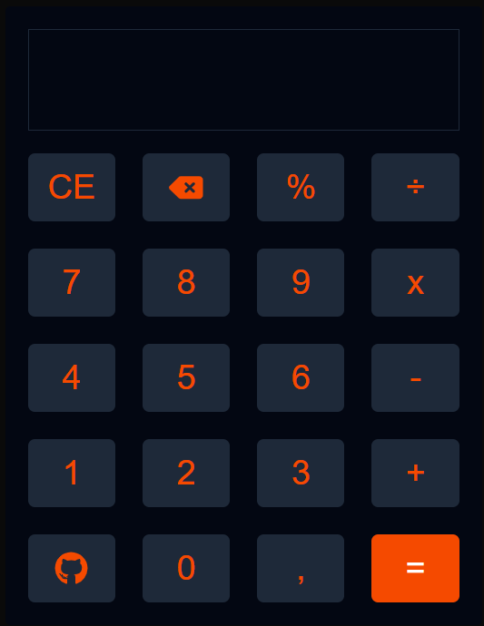

# 🧮 Simple Calculator 🖩

A beautiful and minimalist calculator built with **Next.js**. This project demonstrates the power of modern web development by combining simplicity and functionality.

## 📟 Technologies Used

- **Next.js 15**
- **React**
- **TypeScript**
- **Tailwind**
- **React-Icons**

## 🖼️ Screenshot



## 🚀 How to run

1. **Clone the Repo**:
   ```bash
   git clone https://github.com/seu-usuario/simple-calculator.git
   
   cd simple-calculator

   pnpm run dev
